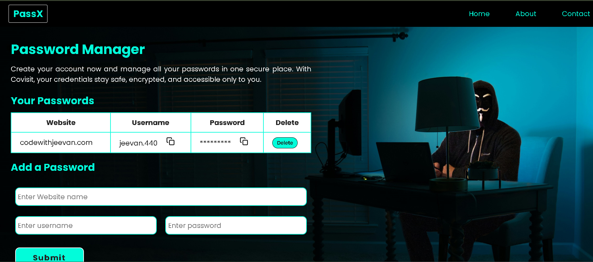

# Password Manager
A simple and user-friendly password Manager web application built using HTML, CSS, and JavaScript. It allows users to securely save, view, copy, and delete passwords for different websites, all stored locally in the browser using localStorage.

## Features
Add website name, username, and password.
View saved credentials in a clean layout.
Passwords are hidden by default (for Security).
Copy username and password with a single click.
Delete saved credentials.
Data is stored securely in browsers Localstorage.

## Tech Stack
HTML, CSS, JavaScript, and localstorage API.

## How to use
You can directly run this app in your browser - no setup required
Live link :  [Click here to view the app](https://jeevan400.github.io/Password-Manager/)

## Screenshots

## Author
Jeevan kumar
GitHub: @jeevan400

## Note
This app is for educational and practice purposes.
Do not store sensitive or real passwords here for production use.